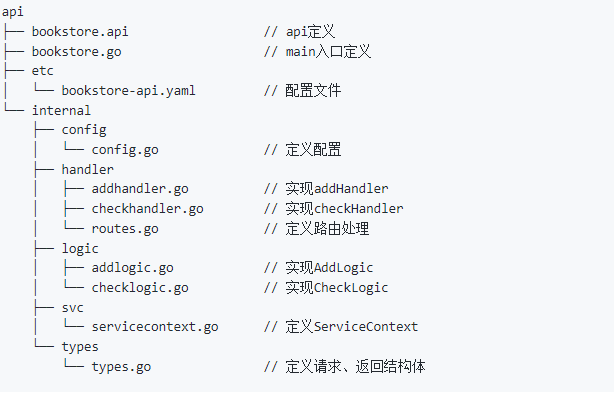
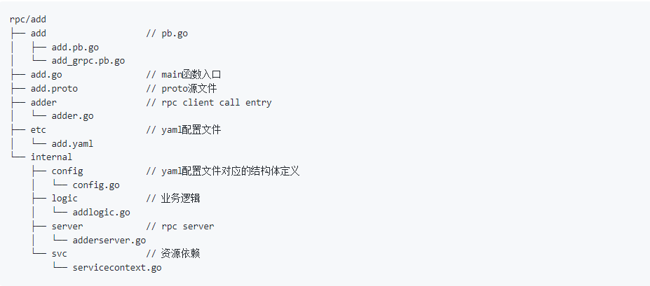

### 1、环境与测试
#### 1、环境搭建
```
go install github.com/zeromicro/go-zero/tools/goctl@latest

goctl -v
```

#### 2、新建服务
```
goctl api new greet
```

#### 3、启动服务
```
go run greet.go -f etc/greet-api.yaml
```

#### 4、生成pb
使用greet.api生成pb

### 2、代码编写
#### 1、新建文件夹并声称.api文件
如 
```
mkdir bookstore

goctl api -o bookstore.api
```

#### 2、修改.api文件并生成代码
遵循go-zero标准

生成代码命令
```
goctl api go -api bookstore.api -dir .
```
文件目录结构如下



#### 3、启动&测试
* 启动
```
go run bookstore.go -f etc/bookstore-api.yaml
```
* 测试
```
curl -i "http://localhost:8888/check?book=go-zero"
```

#### 4、添加rpc服务
##### 1、生成proto文件
在bookstore目录下创建rpc/add子目录，并进入到add目录下，然后执行命令使用默认模板生成proto
```
goctl rpc -o add.proto
```
##### 2、生成rpc代码
根据实际情况修改proto文件，然后在`rpc/add`目录下执行
```
goctl rpc protoc add.proto --go_out=. --go-grpc_out=. --zrpc_out=.
```
执行完后结果如下


##### 3、启动服务
```
go run add.go -f etc/add.yaml
```
### 3、多个rpc服务间调用
参考文档：[快速构建微服务-多RPC版](https://github.com/zeromicro/zero-doc/blob/main/docs/zero/bookstore.md)

### 4、文档
[go-zero官方文档](https://github.com/zeromicro/go-zero/blob/master/readme-cn.md)